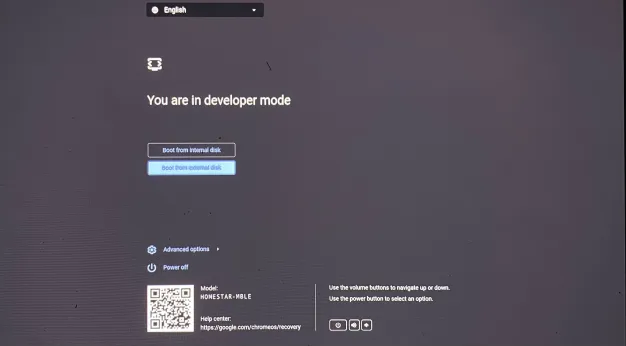
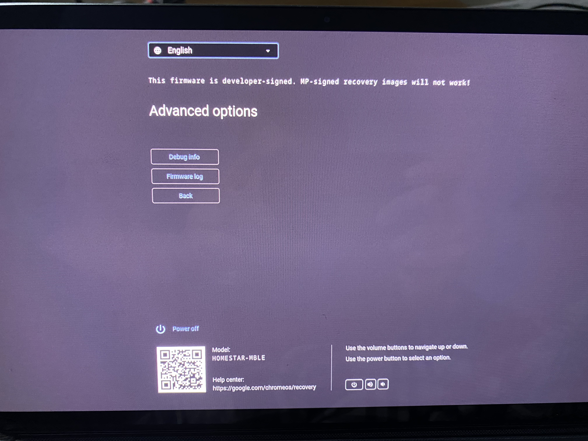
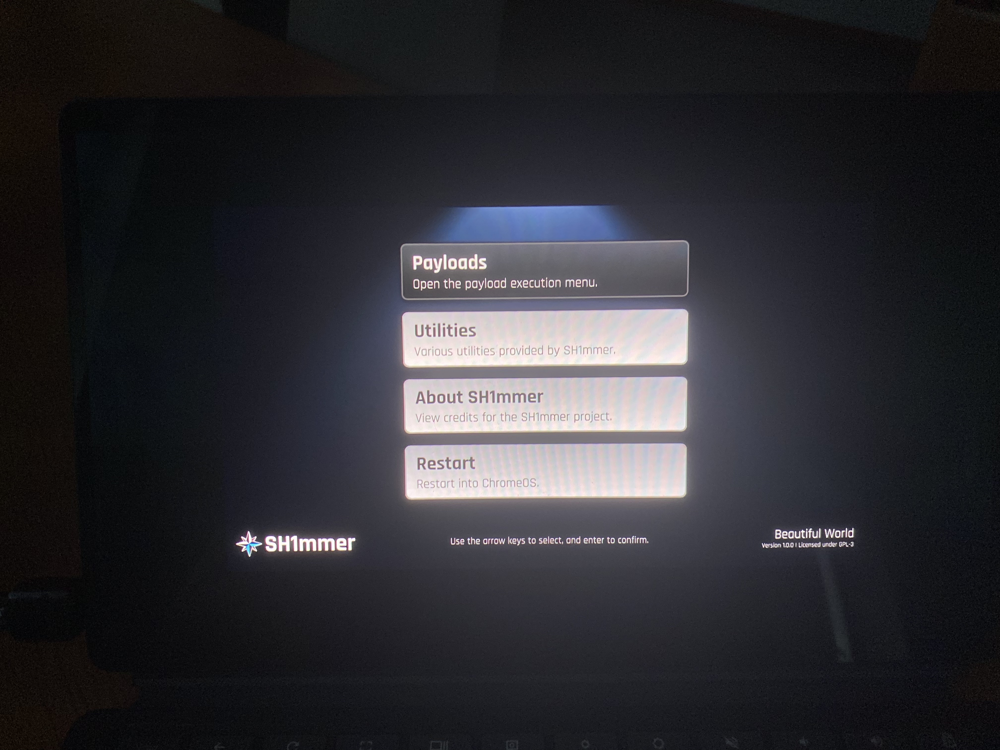
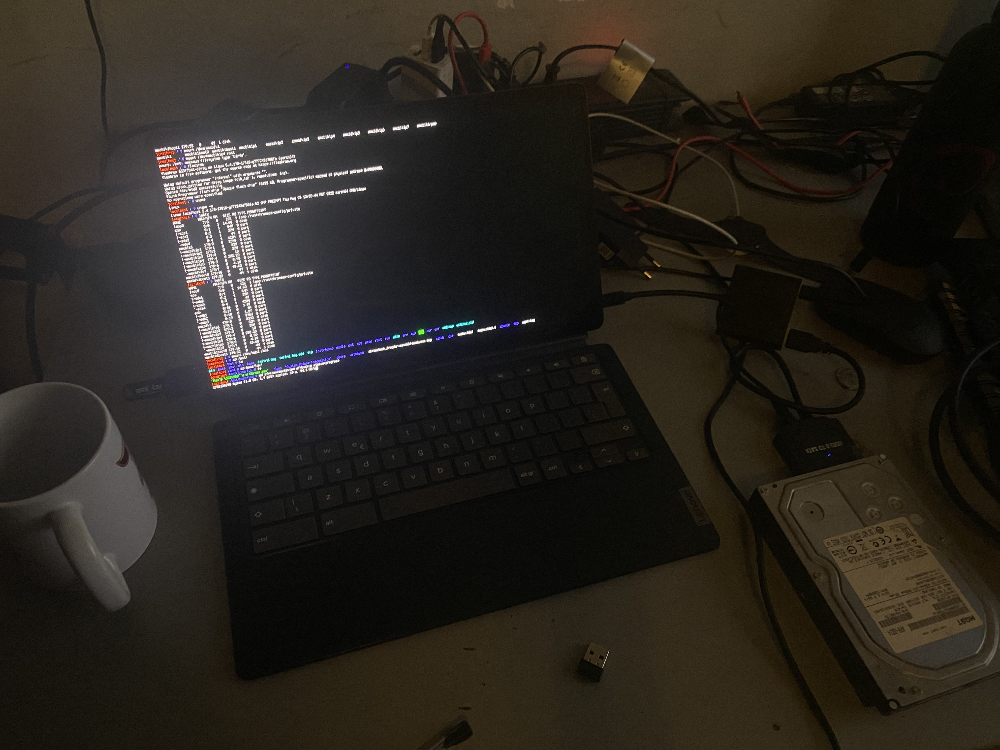
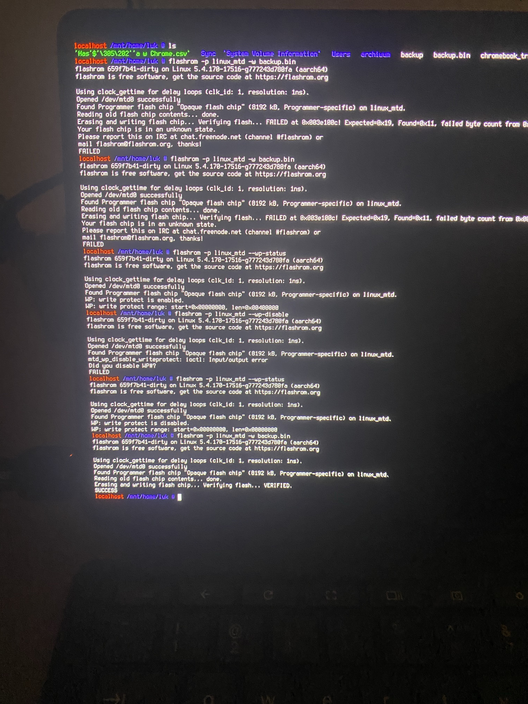
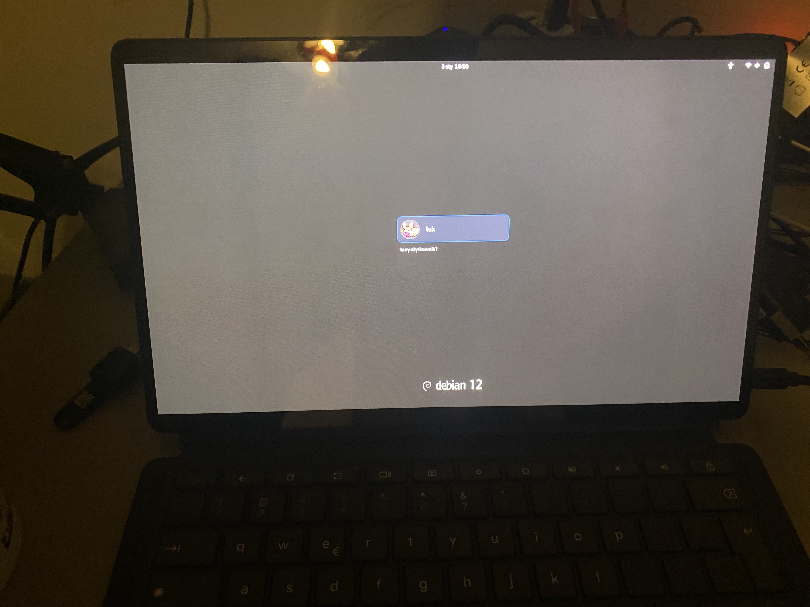

# Attempt at rekeying a chromebook
(this is not a solution, look below)




chromebooks with developer mode enabled (which is needed to boot non-chromeos)
have a big warning screen which for some might as well not exist

based on [chrome os documentation](https://chromium.googlesource.com/chromiumos/platform/vboot_reference/+/refs/heads/main/futility/docs/cmd_gbb_utility.md) if we are able to generate key pair in **correct format** we should be able to ```futility gbb --set --rootkey=file img``` to modify the root key from debian side

we might also create some universal key (with known private key) everyone (who wants to) can set as recovery key so if they frick up their install they can use our debian image as recovery

which means we could drop [the modifying background shenanigans](https://github.com/hexdump0815/imagebuilder/blob/main/todo.txt) and use our system like a normal system

if you think that sound to goot to be true you are right

### DO NOT attemp it

unless you are okay with losing your device



it will royally frick ur machine **without** any **clear** way of **recovery**

as it turend out it's not as simple as swapping gbb key. we would also need to sign the already present firmware with them. Other wise you will **not be able to boot anything** on your device.

**the only reason** i am even capable of fixing it, is fact my device is still vulnerable to sh1mmer (**this is not always the case**, i have strongbad device that's not vunerable to it, and **that device would be a brick** at this point)



i have two homestars (v3) and (v4) (it's likely not a good idea to exchange firmware between them) so i'm like double doomed since i have to manually extract my gbb backup from the oryginal one which doesn't have support for btrfs (while running sh1mmer)

have to dump 200gb fs into slow hdd
in order to open it on a diffrent device and get my gbb backup



true nightmare fuel
make sure to always disable software write protection


but my beloved is back


not a great way to spend weekend

**but is there not hope?**

well there is in theory

if and only if someone firgures out the [make_dev_firmware.sh](https://chromium.googlesource.com/chromiumos/platform/vboot_reference/+/master/scripts/image_signing/make_dev_firmware.sh) script and makes it work on debian
we might be able to actually perform that operation safely

but right now i am too traumatized to do it
i wish luck to anyone who would want to attempt that
**pls be careful**