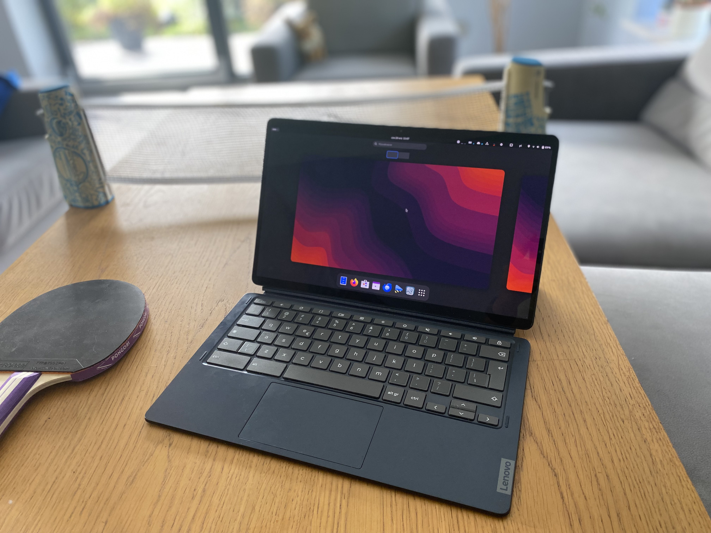

# Fixing audio on homestar



this is homestar and by default on debian its audio is not working

while someone managed to find "[a solution](https://github.com/hexdump0815/imagebuilder/issues/44#issuecomment-1913130004)" it doesn't seam to be reproducible

there is [temporary solution](https://github.com/hexdump0815/imagebuilder/issues/68#issuecomment-2186001368) that makes only speakers on one side work

after looking at [this](https://gitlab.com/postmarketOS/pmaports/-/issues/2510#note_1813888035) i figured out a solution

```
luk@backluk:~$ diff /usr/share/alsa/ucm2/Qualcomm/sc7180/rt5682-max98357a/HiFi.conf ~/Pobrane/HiFi.conf 
13c13
< 		PlaybackChannels 2 <- broken
---
> 		PlaybackChannels 4 <- works
```
just put [HiFi.conf](https://gitlab.com/-/project/8065375/uploads/ac23613adaf88501e0906a032d2f4b82/HiFi.conf) in ```/usr/share/alsa/ucm2/Qualcomm/sc7180/rt5682-max98357a/HiFi.conf```
<details>
<summary>file content</summary>

```
# Use case configuration for ALC5682+MAX98357A on SC7180

SectionVerb {
	Value {
		TQ "HiFi"
	}
}

SectionDevice."Speaker" {
	Comment "Speaker"

	Value {
		PlaybackChannels 4
		PlaybackPCM "hw:${CardId},1"
		PlaybackPriority 100
		PlaybackMixerElem "Speaker"
		PlaybackVolume "Speaker Playback Volume"
	}
}

SectionDevice."Headphones" {
	Comment "Headphones"

	EnableSequence [
		cset "name='HPOL Playback Switch' 1"
		cset "name='HPOR Playback Switch' 1"
		cset "name='Stereo1 DAC MIXL DAC L1 Switch' 1"
		cset "name='Stereo1 DAC MIXR DAC R1 Switch' 1"
	]

	DisableSequence [
		cset "name='HPOL Playback Switch' 0"
		cset "name='HPOR Playback Switch' 0"
		cset "name='Stereo1 DAC MIXL DAC L1 Switch' 0"
		cset "name='Stereo1 DAC MIXR DAC R1 Switch' 0"
	]

	Value {
		PlaybackPCM "hw:${CardId},0"
		PlaybackPriority 200
		PlaybackMasterElem "DAC1"
		PlaybackMixerElem "Headphone"
		PlaybackVolume "Headphone Playback Volume"
	}
}

SectionDevice."Mic" {
	Comment "Internal Microphone"

	ConflictingDevice [
		"Headset"
	]

	EnableSequence [
		cset "name='IF1 01 ADC Swap Mux' 1"
		cset "name='Stereo1 ADC L2 Mux' 1"
		cset "name='Stereo1 ADC R2 Mux' 1"
		cset "name='Stereo1 ADC MIXL ADC2 Switch' 1"
		cset "name='Stereo1 ADC MIXR ADC2 Switch' 1"
	]

	DisableSequence [
		cset "name='Stereo1 ADC L2 Mux' 0"
		cset "name='Stereo1 ADC R2 Mux' 0"
		cset "name='Stereo1 ADC MIXL ADC2 Switch' 0"
		cset "name='Stereo1 ADC MIXR ADC2 Switch' 0"
	]

	Value {
		CapturePCM "hw:${CardId},0"
		CapturePriority 100
		CaptureMixerElem "STO1 ADC"
		CaptureVolume "STO1 ADC Capture Volume"
	}
}

SectionDevice."Headset" {
	Comment "Headset Microphone"

	EnableSequence [
		cset "name='IF1 01 ADC Swap Mux' 2"
		cset "name='Stereo1 ADC L1 Mux' 1"
		cset "name='Stereo1 ADC R1 Mux' 1"
		cset "name='Stereo1 ADC MIXL ADC1 Switch' 1"
		cset "name='Stereo1 ADC MIXR ADC1 Switch' 1"
	]

	DisableSequence [
		cset "name='Stereo1 ADC L1 Mux' 0"
		cset "name='Stereo1 ADC R1 Mux' 0"
		cset "name='Stereo1 ADC MIXL ADC1 Switch' 0"
		cset "name='Stereo1 ADC MIXR ADC1 Switch' 0"
	]

	Value {
		CapturePCM "hw:${CardId},0"
		CapturePriority 200
		CaptureMixerElem "STO1 ADC"
		CaptureVolume "STO1 ADC Capture Volume"
	}
}
```
</details>

reboot your device and now it works 🥳🥳🥳


### There is more

but we can go one step further

i figured i might as well as give ya sth from myself to this 

like getting rid of non existing headphones


so i looked at [this monster](https://github.com/hexdump0815/imagebuilder/blob/main/systems/chromebook_trogdor/extra-files/usr/share/alsa/ucm2/SC7180/HiFi.conf) where author just decided to just comment it out

### one bleblesh later 🛠️

we have a file [HiFi.conf.txt](https://github.com/user-attachments/files/17055968/HiFi.conf.txt) (i cannot upload it as just .conf because github)
<details>
<summary>file content</summary>

```
# Use case configuration for ALC5682+MAX98357A on SC7180

SectionVerb {
	Value {
		TQ "HiFi"
	}
}

SectionDevice."Speaker" {
	Comment "Speaker"

	Value {
		PlaybackChannels 4
		PlaybackPCM "hw:${CardId},1"
		PlaybackPriority 100
		PlaybackMixerElem "Speaker"
		PlaybackVolume "Speaker Playback Volume"
	}
}

#SectionDevice."Headphones" {
#	Comment "Headphones"
#
#	EnableSequence [
#		cset "name='HPOL Playback Switch' 1"
#		cset "name='HPOR Playback Switch' 1"
#		cset "name='Stereo1 DAC MIXL DAC L1 Switch' 1"
#		cset "name='Stereo1 DAC MIXR DAC R1 Switch' 1"
#	]
#
#	DisableSequence [
#		cset "name='HPOL Playback Switch' 0"
#		cset "name='HPOR Playback Switch' 0"
#		cset "name='Stereo1 DAC MIXL DAC L1 Switch' 0"
#		cset "name='Stereo1 DAC MIXR DAC R1 Switch' 0"
#	]
#
#	Value {
#		PlaybackPCM "hw:${CardId},0"
#		PlaybackPriority 200
#		PlaybackMasterElem "DAC1"
#		PlaybackMixerElem "Headphone"
#		PlaybackVolume "Headphone Playback Volume"
#	}
#}

SectionDevice."Mic" {
	Comment "Internal Microphone"

#	ConflictingDevice [
#		"Headset"
#	]

	EnableSequence [
		cset "name='IF1 01 ADC Swap Mux' 1"
		cset "name='Stereo1 ADC L2 Mux' 1"
		cset "name='Stereo1 ADC R2 Mux' 1"
		cset "name='Stereo1 ADC MIXL ADC2 Switch' 1"
		cset "name='Stereo1 ADC MIXR ADC2 Switch' 1"
	]

	DisableSequence [
		cset "name='Stereo1 ADC L2 Mux' 0"
		cset "name='Stereo1 ADC R2 Mux' 0"
		cset "name='Stereo1 ADC MIXL ADC2 Switch' 0"
		cset "name='Stereo1 ADC MIXR ADC2 Switch' 0"
	]

	Value {
		CapturePCM "hw:${CardId},0"
		CapturePriority 100
		CaptureMixerElem "STO1 ADC"
		CaptureVolume "STO1 ADC Capture Volume"
	}
}

#SectionDevice."Headset" {
#	Comment "Headset Microphone"
#
#	EnableSequence [
#		cset "name='IF1 01 ADC Swap Mux' 2"
#		cset "name='Stereo1 ADC L1 Mux' 1"
#		cset "name='Stereo1 ADC R1 Mux' 1"
#		cset "name='Stereo1 ADC MIXL ADC1 Switch' 1"
#		cset "name='Stereo1 ADC MIXR ADC1 Switch' 1"
#	]
#
#	DisableSequence [
#		cset "name='Stereo1 ADC L1 Mux' 0"
#		cset "name='Stereo1 ADC R1 Mux' 0"
#		cset "name='Stereo1 ADC MIXL ADC1 Switch' 0"
#		cset "name='Stereo1 ADC MIXR ADC1 Switch' 0"
#	]
#
#	Value {
#		CapturePCM "hw:${CardId},0"
#		CapturePriority 200
#		CaptureMixerElem "STO1 ADC"
#		CaptureVolume "STO1 ADC Capture Volume"
#	}
#}
```
</details>

again put it here ```/usr/share/alsa/ucm2/Qualcomm/sc7180/rt5682-max98357a/HiFi.conf``` ... now reboot

and it works 🎉🎉🎉🎈


### One more

we forgot about hdmi

(there is no hdmi port but you can use usb-c to hdmi adapter)

but there is a problem, if we include hdmi in ucm while it's not plugget in there is no audio.

so i have figured out not perfect solution

by conflicting hdmi with speaker we can get it to configure only when available

if we don't do that the ucm doesn't work again ([why?](https://github.com/alsa-project/alsa-ucm-conf/issues/442#issuecomment-2411665486) idk)
```
# Use case configuration for ALC5682+MAX98357A on SC7180

SectionVerb {
	Value {
		TQ "HiFi"
	}
}

SectionDevice."Speaker" {
	Comment "Speaker"

	Value {
		PlaybackChannels 4
		PlaybackPCM "hw:${CardId},1"
		PlaybackPriority 100
		PlaybackMixerElem "Speaker"
		PlaybackVolume "Speaker Playback Volume"
	}
}

SectionDevice."Mic" {
	Comment "Internal Microphone"

	EnableSequence [
		cset "name='IF1 01 ADC Swap Mux' 1"
		cset "name='Stereo1 ADC L2 Mux' 1"
		cset "name='Stereo1 ADC R2 Mux' 1"
		cset "name='Stereo1 ADC MIXL ADC2 Switch' 1"
		cset "name='Stereo1 ADC MIXR ADC2 Switch' 1"
	]

	DisableSequence [
		cset "name='Stereo1 ADC L2 Mux' 0"
		cset "name='Stereo1 ADC R2 Mux' 0"
		cset "name='Stereo1 ADC MIXL ADC2 Switch' 0"
		cset "name='Stereo1 ADC MIXR ADC2 Switch' 0"
	]

	Value {
		CapturePCM "hw:${CardId},0"
		CapturePriority 100
		CaptureMixerElem "STO1 ADC"
		CaptureVolume "STO1 ADC Capture Volume"
	}
}

SectionDevice."HDMI" {
	Comment "HDMI"

#fixes the conflict
	ConflictingDevice [
		"Speaker"
	]

	Value {
		PlaybackPriority 200
		PlaybackPCM "hw:${CardId},2"
		JackControl "sc7180-rt5682-max98357a-1mic HDMI Jack"
	}
	EnableSequence [
	]
	DisableSequence [
	]
}
```

meaning that when you plug in hdmi you just need to run ```systemctl --user restart pipewire``` for hdmi to get configured
and after unpluging run again for it to disappear from the device menu


it's not ideal but works

i know that unplugging and plugging in the devices triggers
```
node hw:0, #9 (0,0,0,HDMI Jack,0) VALUE
```
in ```sudo alsactl monitor``` but i have no idea how to use it

and as long as it works it's fine